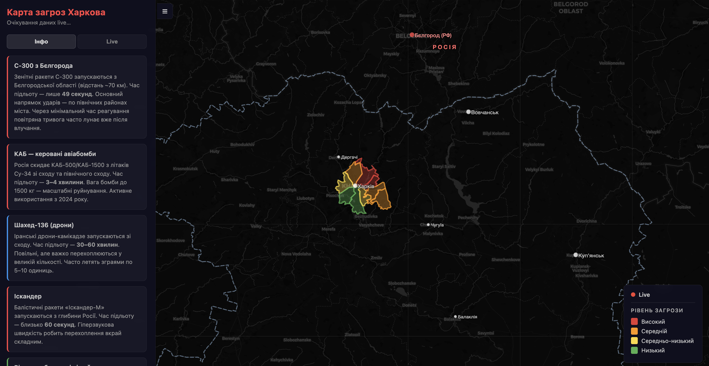

# Kharkiv Threat Map

Simple live map for tracking reported aerial threats around Kharkiv.

## Preview



## Project Structure

- `kharkiv-map-backend` - API, parsing, incident correlation, WebSocket live updates
- `kharkiv-map-app` - frontend map UI (Leaflet) with live incident rendering

## Prerequisites

- Node.js 18+
- npm

## Quick Start

### 1) Install dependencies

```bash
cd kharkiv-map-backend && npm install
cd ../kharkiv-map-app && npm install
```

### 2) Configure backend environment

```bash
cd kharkiv-map-backend
cp .env.example .env
```

Update values in `.env` as needed (tokens, API keys, ports).

### 3) Run backend

```bash
cd kharkiv-map-backend
npm run dev
```

### 4) Run frontend

```bash
cd kharkiv-map-app
npm run dev
```

Open the frontend URL shown in terminal (usually `http://localhost:5173`).

## Notes

- Frontend receives live updates from backend via WebSocket (`/live`).
- District colors can switch to real-time danger levels based on active incidents.